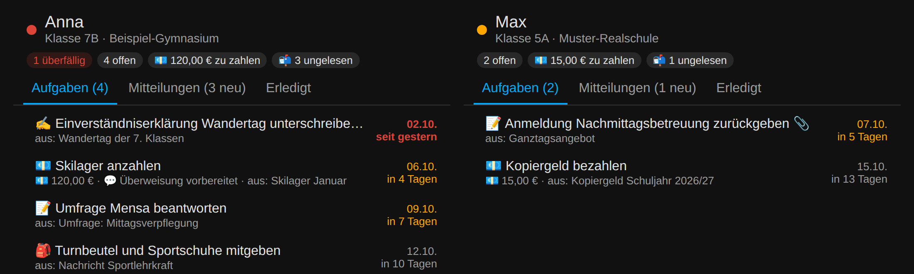
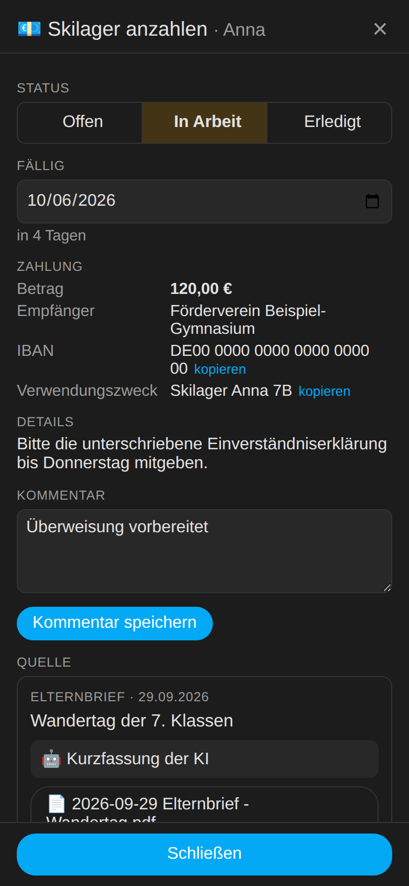
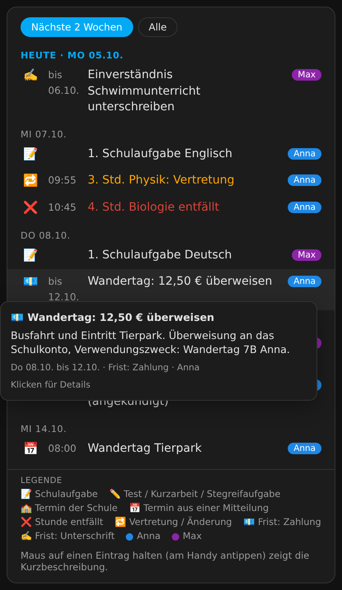
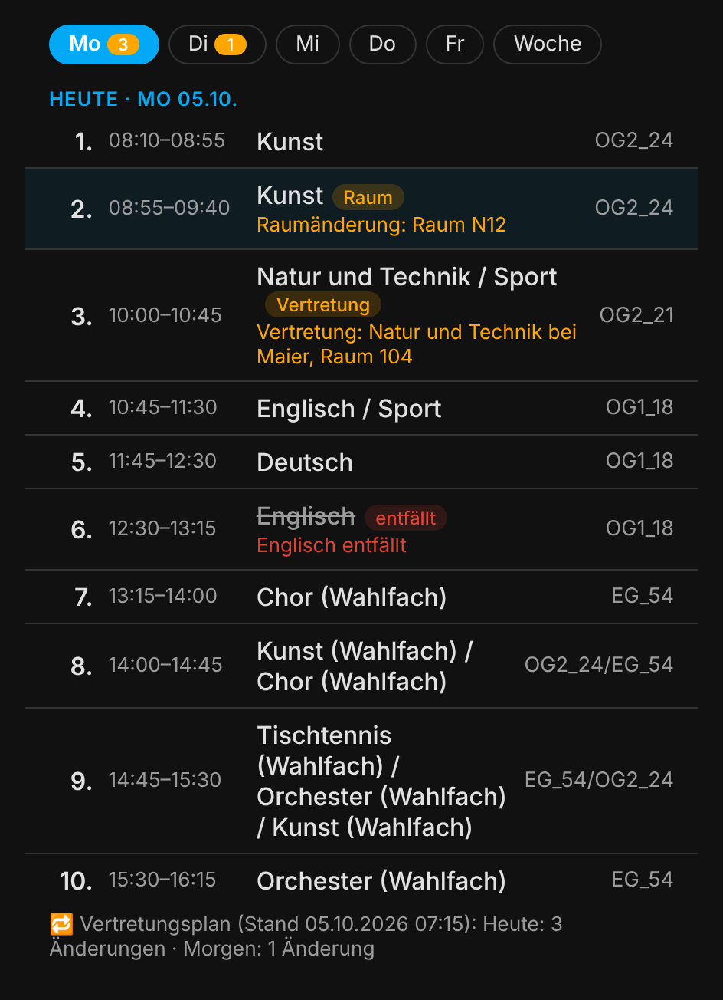

# Schulmanager für Home Assistant

**English:** [README.md](README.md)

Der Schulmanager holt alle Mitteilungen aus dem **[Eltern-Portal](https://www.eltern-portal.org)** selbst ab, legt Elternbriefe und Anhänge pro Kind ab, lässt eine KI daraus Aufgaben, Fristen, Zahlungen und Termine herauslesen und erinnert euch rechtzeitig: per Push aufs Handy, morgens als Tagesübersicht, per Sprachansage und als Ampel im Dashboard. Mehrere Kinder und Schulen laufen in einer Installation.

## Was passiert automatisch

| Schritt | Was der Schulmanager tut |
|---|---|
| Abruf (alle 30 min) | Elternbriefe, Nachrichten der Fachlehrkräfte, Schwarzes Brett, Umfragen, Termine (Schulaufgaben), **Stundenplan** und **Vertretungsplan** aus allen Portalen lesen |
| Ablage | PDFs und Anhänge unter `Medien › schulmanager › <Kind> › <Schuljahr>` speichern, z. B. `Anna/2026-27/2026-09-30 Elternbrief - Wandertag.pdf` |
| Auswertung | Text und PDF-Inhalt an den KI-Dienst von Home Assistant ([AI Task](https://www.home-assistant.io/integrations/ai_task/)) geben: Zusammenfassung, Dringlichkeit, Aufgaben (zahlen, unterschreiben, zurückgeben, mitbringen …), Fälligkeiten, Beträge, IBAN und Verwendungszweck, Termine. Ohne KI gibt es eine einfache Erkennung von Datum und Betrag. |
| Portal-Aufgaben | Offene Umfragen werden zu „Umfrage beantworten“, Briefe ohne Datei zu „Empfang im Portal bestätigen“. Beide haken sich von selbst ab, sobald das im Portal erledigt ist. |
| Push | Pro neuer Mitteilung eine Nachricht an die gewählten Handys, mit den Buttons **Gelesen**, **Erledigt** und **Im Portal öffnen** |
| Vertretungen | Neue Vertretungen, Ausfälle und Raumänderungen ab heute kommen als Push, z. B. „🔁 Vertretungsplan Anna – Morgen: 6. Std. E entfällt“. Beim allerersten Abruf gibt es keine Push. |
| Erinnerung (18:30) | Standardmäßig 3 Tage vorher, am Vortag und am Tag selbst, Überfälliges täglich. Buttons **Erledigt** und **Morgen erinnern**. |
| Tagesübersicht (06:45) | Nur wenn etwas ansteht: Ampel pro Kind, Fristen, Ungelesenes, heutige Termine und heutige Vertretungen |
| Sprachansage | Bei dringenden neuen Mitteilungen und bei Fristen heute/morgen, nur im eingestellten Zeitfenster |

## Die Karten

Die Integration lädt drei Karten automatisch und baut sie ins Dashboard „Schule“ ein. HACS-Frontend-Ressourcen braucht es nicht. Alle drei Karten nehmen optional `child: <kind>`, ohne Angabe zeigen sie alle Kinder.

### Aufgaben & Mitteilungen – `custom:schulmanager-card`

Zeigt pro Kind die Reiter **Aufgaben**, **Mitteilungen** und **Erledigt**.

- **Aufgabe antippen** öffnet die Details: Status **Offen / In Arbeit / Erledigt**, Fälligkeit ändern, eigener **Kommentar**, Zahlungsdaten mit „kopieren“ für IBAN und Verwendungszweck, dazu die **Quelle** mit KI-Zusammenfassung, Originaltext, PDF und Link ins Eltern-Portal.
- **Mitteilung antippen** zeigt Text, PDF und die daraus entstandenen Aufgaben und markiert die Mitteilung als gelesen.
- „In Arbeit“ zählt weiter als offen: Die Aufgabe bleibt in Ampel und Erinnerungen und steht in der To-do-Liste mit ⏳.

### Termine & Fristen – `custom:schulmanager-termine`

- Alle Termine, Fristen und Änderungen aus dem Vertretungsplan nach Tagen sortiert, Überfälliges oben. Umschalten zwischen **Nächste 2 Wochen** und **Alle**.
- **Maus auf einen Eintrag** zeigt die Kurzbeschreibung der KI (am Handy einmal antippen). Ein Klick auf eine Frist oder einen Termin aus einem Brief öffnet die Details.
- Unten erklärt eine **Legende** die Icons: 🏫 Termin aus dem Portal (z. B. Schulaufgabe), 📅 Termin aus einer Mitteilung, ❌ Stunde entfällt, 🔁 Vertretung, 🚪 Raumänderung und die Fristen nach Art (💶 Zahlung, ✍️ Unterschrift, ↩️ Rückmeldung, 🎒 Mitbringen, 📖 Lesen, ✅ Aufgabe). Bei mehreren Kindern hat jedes eine eigene Farbe.

### Stundenplan & Vertretungen – `custom:schulmanager-stundenplan`

- Tagesansicht mit Uhrzeit und Raum, umschaltbar auf die **Woche**. Vormittags zeigt sie den heutigen Tag, nach Schulschluss und am Wochenende den nächsten Schultag.
- Fächer stehen **ausgeschrieben** da („Biologie“ statt „B“, „Mathematik (Intensivierung)“ statt „MInt“, „Sport“ statt „Sm/Sw“). Das Original-Kürzel erscheint, wenn man mit der Maus darauf zeigt.
- Änderungen aus dem Vertretungsplan sind farbig markiert: rot = entfällt, orange = Vertretung oder Raumänderung. Die Zahl an den Wochentagen zeigt, wie viele Änderungen anstehen.

## Voraussetzungen

- Home Assistant **2025.8** oder neuer (eigenes Integrations-Icon ab 2026.3)
- Ein Eltern-Zugang zum Eltern-Portal (`https://<schule>.eltern-portal.org`)
- Optional: eine AI-Task-Entität (z. B. aus der Anthropic-, OpenAI-, Google- oder Ollama-Integration)

## Installation

### Über HACS (empfohlen)

1. HACS → ⋮ → **Benutzerdefinierte Repositories** → `https://github.com/FabusMingAI/ha-schulmanager` mit Typ **Integration** hinzufügen.
2. Nach **Schulmanager** suchen, installieren, Home Assistant neu starten.

### Von Hand

Den Ordner `custom_components/schulmanager` nach `/config/custom_components/schulmanager` kopieren (Samba, Add-on „File editor“ oder Studio Code Server) und Home Assistant neu starten.

## Einrichtung

1. **Einstellungen → Geräte & Dienste → Integration hinzufügen → „Schulmanager“**
2. Schulkennung eingeben (der Teil vor `.eltern-portal.org`) oder einfach den Link aus einer Benachrichtigungs-Mail des Portals einfügen, dazu E-Mail und Passwort. Weitere Schulen direkt im selben Dialog hinzufügen.
3. **Integration → Konfigurieren → Einstellungen**
   - **KI-Dienst**: eure AI-Task-Entität. Ohne KI greift nur die einfache Regel-Erkennung.
   - **Push an**: z. B. `mobile_app_<handy_1>` und `mobile_app_<handy_2>`
   - **Sprachansagen auf**: Assist-Satelliten (Ansage direkt) oder Lautsprecher (dafür zusätzlich einen TTS-Dienst wählen)
4. **Dashboard**: Der Schulmanager legt das Dashboard **„Schule“** in der Seitenleiste selbst an – mit den Reitern **Übersicht** (Termine & Fristen aller Kinder und Status) und **einem Reiter pro Kind** (Aufgaben, Mitteilungen, Stundenplan mit Vertretungen, Termine), ideal fürs Handy. Unter **Konfigurieren → Einstellungen → Dashboard „Schule“** lässt sich auf *Eine Seite* oder *Nicht verwalten* umstellen. Von Hand geänderte Dashboards bleiben unangetastet (neu erzeugen mit der Aktion `schulmanager.rebuild_dashboard`). Die YAML-Datei unter [`dashboard/`](dashboard/schulmanager_dashboard.yaml) ist nur noch ein Beispiel für eigene Dashboards.

Beim ersten Abruf werden die Mitteilungen der letzten 120 Tage übernommen. Nur die der letzten 21 Tage (und alle noch unbestätigten Briefe) werden ausgewertet und als ungelesen markiert, der Rest landet als gelesen im Archiv. Es gibt einmalig eine kurze Einrichtungs-Push statt einer Flut.

## Was in Home Assistant entsteht (pro Kind)

- `sensor.schule_<kind>_status`: Ampel `rot` / `gelb` / `gruen`. In den Attributen stehen alle offenen Aufgaben und die letzten 25 Mitteilungen mit Zusammenfassung, PDF-Link und Portal-Link.
  - **rot**: etwas ist überfällig, heute oder morgen fällig, oder eine dringende Mitteilung ist ungelesen
  - **gelb**: etwas ist offen oder ungelesen
  - **grün**: alles erledigt
- `todo.schule_<kind>_aufgaben`: Aufgabenliste. Abhaken, Datum ändern und eigene Aufgaben ergänzen geht ganz normal, auch per Sprachassistent.
- `calendar.schule_<kind>_kalender`: Fristen, Termine aus den Briefen, Schulaufgaben aus dem Portal sowie Vertretungen und Ausfälle (mit Uhrzeit laut Stundenplan)
- `sensor.schule_<kind>_offene_zahlungen` (€), `…_nachste_frist`, `…_uberfallig`, `…_offene_aufgaben`, `…_ungelesene_mitteilungen`
- `sensor.schule_<kind>_stundenplan`: Zahl der Stunden heute; Tages-, Folgetags- und Wochenplan als Attribute
- `sensor.schule_<kind>_vertretungen`: Zahl der Änderungen ab heute; Attribute `heute`, `morgen` und alle Einträge (Stunde, Fach, Vertretung, Raum, Info, Art: `entfall`/`vertretung`/`raum`). Neue Einträge kommen als Push, heutige stehen in der Tagesübersicht, alle im Kalender.
- `sensor.schulmanager_letzter_abruf`: Diagnose, mit Fehlern und Anzahl noch ausstehender Auswertungen

## Aktionen (für Automationen, Skripte, Assist)

| Aktion | Zweck |
|---|---|
| `schulmanager.refresh` | Portale sofort abrufen |
| `schulmanager.mark_read` | `child: anna` oder `item_id: …`, ohne Angabe: alles |
| `schulmanager.complete_task` | `task_id: …` |
| `schulmanager.update_task` | `task_id` und `status`, `comment`, `due` oder `title` |
| `schulmanager.add_task` | `child`, `title`, optional `due`, `amount`, `details`, `type` |
| `schulmanager.reanalyze` | eine Mitteilung neu von der KI auswerten lassen |
| `schulmanager.send_digest` / `send_reminders` | Übersicht oder Erinnerungen sofort schicken |
| `schulmanager.rebuild_dashboard` | Dashboard „Schule“ neu erzeugen |
| `schulmanager.get_overview` | liefert alles als Antwort, z. B. für ein Assist-Skript „Was ist für die Schule zu tun?“ |

Events für eigene Automationen: `schulmanager_new_item` (mit `child`, `title`, `summary`, `urgency`, `tasks`), `schulmanager_task_reminder` und `schulmanager_substitution` (neue Vertretungen, mit `child` und `entries`). Damit lässt sich z. B. bei einer dringenden Mitteilung das Flurlicht kurz orange blinken lassen.

## Gut zu wissen

- **Empfangsbestätigung:** Das Eltern-Portal zählt das Herunterladen eines Elternbriefs als „Empfang bestätigt“. Mit aktivierter automatischer Ablage bestätigt der Schulmanager deshalb neue Briefe, sobald er die PDF holt. Wer das nicht will, schaltet „Anhänge/PDFs automatisch ablegen“ aus. Dann entsteht je Brief die Aufgabe „Empfang im Portal bestätigen“.
- **Datenschutz:** Alles bleibt in Home Assistant. Ausnahme: Ist ein KI-Dienst gewählt, gehen Text und PDF-Inhalt der Mitteilung zur Auswertung an dessen Anbieter. PDF-Links im Dashboard sind signiert (30 Tage gültig) und ohne Anmeldung bzw. Signatur nicht abrufbar.
- **Inoffiziell:** Das Portal hat keine offizielle Schnittstelle. Der Zugriff läuft über die Bibliothek [pyelternportal](https://github.com/michull/pyelternportal), die das HTML ausliest. Ändert der Anbieter das Layout, kann ein Bereich vorübergehend ausfallen. Der Fehler steht dann in `sensor.schulmanager_letzter_abruf`, die übrigen Bereiche laufen weiter.
- **Stunden- und Vertretungsplan** gibt es nur, wenn die Schule sie im Eltern-Portal freigeschaltet hat. Liefert das Portal kurzzeitig eine leere Seite, bleibt der zuletzt gelesene Plan stehen.
- **Noch nicht enthalten:** „Kommunikation Eltern/Klassenleitung“ (nur Fachlehrkräfte), Krankmeldungen und das Klassenbuch.
- Wer zusätzlich die HACS-Integration `elternportal` nutzt, sollte auf dieselbe `pyelternportal`-Version achten (hier 0.0.25).
- Dieses Projekt steht in keiner Verbindung zum Eltern-Portal oder dessen Betreiber.

## Lizenz

[MIT](LICENSE)
