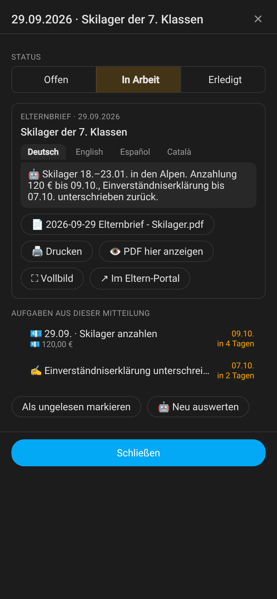
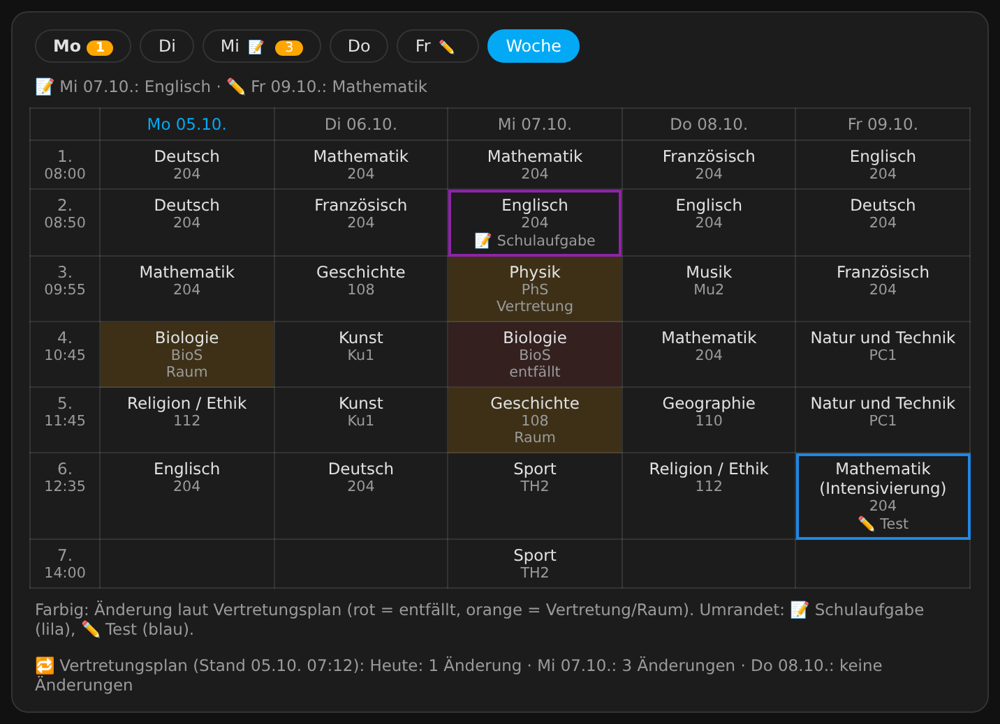

# Schulmanager for Home Assistant

[](https://hacs.xyz/docs/faq/custom_repositories)
[](https://github.com/FabusMingAI/ha-schulmanager/actions/workflows/validate.yml)
[](https://github.com/FabusMingAI/ha-schulmanager/actions/workflows/tests.yml)
[](LICENSE)

**Deutsch:** [README.de.md](README.de.md)

Schulmanager turns the flood of school messages from **[Eltern-Portal](https://www.eltern-portal.org)** (used by many schools in Bavaria and other German states) into tasks, deadlines and reminders in Home Assistant – for all your children and schools in one place.

It signs in to the portal itself, stores parent letters and attachments per child, lets an AI read out what you actually have to do (sign, pay, return, bring along …) and reminds you in time.


> [!NOTE]
> Schulmanager is a private hobby project and is not affiliated with the provider of Eltern-Portal. It reads the portal's web pages because there is no official API, so changes to the portal can break single features at any time. Use at your own risk, without warranty. Bug reports and ideas are welcome as [issues](https://github.com/FabusMingAI/ha-schulmanager/issues) – answers come when time allows.

## Features

- **Reads the portal directly** – parent letters (*Elternbriefe*), messages from teachers, notice board, surveys, **exams and tests** (*Schulaufgaben, Stegreifaufgaben* …), **timetable**, **substitution plan** (*Vertretungsplan*) and **sick notes** (*Krankmeldungen*). Several schools and children with one installation.
- **Files per child** – PDFs and attachments go to `Media › schulmanager › <child> › <school year>`.
- **AI analysis** via Home Assistant's [AI Task](https://www.home-assistant.io/integrations/ai_task/) (Anthropic, OpenAI, Google, Ollama …): summary, urgency, tasks, deadlines, amounts, IBAN and payment reference, appointments. Without AI a simple rule-based detection is used.
- **Tasks with status** *open / in progress / done*, comments, due dates – as a to-do list, calendar and sensors.
- **Reminders** by push notification (with *Done* and *Remind me tomorrow* buttons), a daily morning summary and optional voice announcements.
- **Exams and tests in the timetable** – exams (*Schulaufgaben*) and tests (*Tests, Kurzarbeiten, Stegreifaufgaben*) from the portal's appointments are highlighted in the timetable and appear in the calendar; the morning summary mentions tomorrow's exams. Other school appointments (holidays, office hours …) are hidden by default and can be switched on in the settings.
- **Timetable & substitutions** – cancelled lessons, substitute teachers and room changes appear in the timetable card, the calendar (with lesson times) and the morning summary; a new change triggers a push notification.
- **Traffic light per child** – red / yellow / green for dashboards and automations.
- **Three dashboard cards included**, set up automatically in the "Schule" dashboard – see [The cards](#the-cards).

> The user interface texts of the cards, notifications and the AI output are in German, because Eltern-Portal is a German service. Configuration dialogs are available in English and German.

## The cards

The integration loads three cards automatically and places them in the "Schule" dashboard; no HACS frontend resources are needed. All three accept an optional `child: <name>`; without it they show all children.

### Tasks & messages – `custom:schulmanager-card`

Shows the tabs **Aufgaben** (tasks), **Mitteilungen** (messages) and **Erledigt** (done) per child.

<p align="left"> </p>

- Every task shows the **date its message appeared in Eltern-Portal** in front of the title (`29.09. · Skilager anzahlen`; own tasks: the day you added them) – also in the dialogs (with year), the morning summary and the to-do lists.
- While AI summaries are being translated (e.g. after adding a language), a progress line "🌐 Zusammenfassungen werden übersetzt …: 34 von 90" appears at the top of the card.
- **Tap a task** to open its details: status **open / in progress / done**, change the due date, add your own **comment**, payment details with "copy" for IBAN and payment reference, plus the **source** with AI summary, original text, PDF and a link to Eltern-Portal.
- **Tap a message** to see its text, the PDF and the tasks created from it; it is marked as read. Messages also have the status **open / in progress / done**: done messages move to the **Erledigt** tab (and count as read), messages in progress show ⏳.
- The **AI summary** has one tab per language chosen in the settings (German, English, Spanish, Catalan).
- **PDFs:** "Drucken" opens the browser's print dialog, "Vollbild" shows the PDF full screen (on phones without full-screen support it opens in a new tab).
- "In progress" still counts as open: the task stays in the traffic light and reminders and shows up in the to-do list with ⏳.

### Appointments & deadlines – `custom:schulmanager-termine`

<p align="left"></p>

- All appointments, deadlines and substitution plan changes, grouped by day, overdue items on top. Switch between **next 2 weeks** and **all**.
- **Hover an entry** to see the AI's short summary (tap once on phones). Clicking a deadline or an appointment taken from a letter opens its details.
- A **legend** at the bottom explains the icons: 📝 exam (*Schulaufgabe*), ✏️ test / short test / pop quiz, 🏫 school appointment, 📅 appointment from a message, ❌ lesson cancelled, 🔁 substitution, 🚪 room change, 🤒 sick note, and deadlines by type (💶 payment, ✍️ signature, ↩️ reply, 🎒 bring along, 📖 read, ✅ task). With several children each one gets its own colour.

### Timetable & substitutions – `custom:schulmanager-stundenplan`

<p align="left"></p>

<p align="left"></p>

<p align="left"><sub>Screenshots show made-up demo data (`docs/screenshots/demo.html`, regenerate with `python docs/screenshots/make_screenshots.py`).</sub></p>

- Day view with times and rooms, switchable to the whole **week**. In the morning it shows today; after the last lesson and at weekends it shows the next school day. With `view: week` the card starts in the week view; the "Schule" dashboard uses this for all timetables.
- The week view fits narrow cards (e.g. half a column or a phone) without horizontal scrolling: subjects are shortened there ("Mathe", "Engl.", "Reli/Eth", "SA" for exam).
- Subjects are **written out** ("Biologie" instead of "B", "Mathematik (Intensivierung)" instead of "MInt", "Sport" instead of "Sm/Sw"); hover a subject to see the original abbreviation.
- Changes from the substitution plan are highlighted: red = cancelled, orange = substitution or room change. The number on a weekday shows how many changes are coming up.
- **Exams and tests** are marked: 📝 / ✏️ on the weekday buttons, a box above the lessons of that day and a badge on the matching subject (purple = exam, blue = test). Upcoming ones for the next two weeks are listed above the timetable.

## Requirements

- Home Assistant **2025.8** or newer (custom brand icon from 2026.3)
- An Eltern-Portal parent account (`https://<school>.eltern-portal.org`)
- Optional: an AI Task entity for the analysis

## Installation

### HACS (recommended)

1. HACS → ⋮ → **Custom repositories** → add `https://github.com/FabusMingAI/ha-schulmanager`, type **Integration**.
2. Search for **Schulmanager**, install, restart Home Assistant.

[](https://my.home-assistant.io/redirect/hacs_repository/?owner=FabusMingAI&repository=ha-schulmanager&category=integration)

### Manual

Copy `custom_components/schulmanager` to `/config/custom_components/schulmanager` and restart Home Assistant.

## Setup

1. **Settings → Devices & services → Add integration → Schulmanager**
2. Enter the school code (the part before `.eltern-portal.org`) – or simply paste the link from a portal notification e-mail – plus e-mail and password. Add more schools in the same dialog.
3. **Configure → Settings** – grouped into collapsible sections (*KI & Sprachen*, *Benachrichtigungen & Erinnerungen*, *Termine & Klassen* open; *Sprachansagen*, *Abruf & Ablage*, *Dashboard* collapsed), every field with a short explanation: choose the AI Task entity, the phones for push notifications (`notify.mobile_app_…`), reminder days and times, optionally speakers or Assist satellites for announcements, **which portal appointments to show** (default: exams and tests; optionally also school appointments), **only appointments of the child's class** (default on: hides entries such as "Schullandheim 5b+5c" or "Jgst. 10" that name only other classes or grades) and the **languages of the AI summary** (checkboxes for German, English, Spanish, Catalan, up to 4; default German and English; the first one is used for push notifications). If an already analysed message lacks a language – also after you add one – the AI translates just the summary in the background; tasks, appointments and status stay untouched. With 5 or more translations you get a Home Assistant notification when they start (with an estimated duration) and when they are done; a failed translation is retried after 6 hours, up to 3 attempts.
4. **Dashboard**: the integration creates the **"Schule"** dashboard in the sidebar by itself – tabs **Overview** (appointments & deadlines of all children on the left, each child's timetable with substitutions on the right, plus a "⚙️ Einstellungen" link to the integration settings in the header) plus **one tab per child** (tasks & messages, timetable with substitutions, appointments), ideal on phones. Under **Configure → Settings → "Schule" dashboard** you can switch to *Single page* or *Do not manage*. Dashboards you change by hand are left alone (regenerate with the action `schulmanager.rebuild_dashboard`). The YAML in [`dashboard/`](dashboard/schulmanager_dashboard.yaml) is only an example for your own dashboards.

On the first run the last 120 days are imported; only the last 21 days (and all unconfirmed letters) are analysed and marked unread, older items go to the archive as read.

## Entities (per child)

| Entity | Description |
|---|---|
| `sensor.schule_<child>_status` | Traffic light `rot` / `gelb` / `gruen`; attributes contain open tasks and recent messages |
| `todo.schule_<child>_aufgaben` | Task list – complete, reschedule, add your own tasks |
| `calendar.schule_<child>_kalender` | Deadlines, appointments from letters, exams and tests (school appointments if enabled), substitutions, cancelled lessons and sick notes |
| `sensor.schule_<child>_offene_zahlungen` | Open payments in € |
| `sensor.schule_<child>_nachste_frist`, `…_uberfallig`, `…_offene_aufgaben`, `…_ungelesene_mitteilungen` | Counters and next deadline |
| `sensor.schule_<child>_stundenplan` | Timetable: lessons today; day and week plan as attributes |
| `sensor.schule_<child>_vertretungen` | Substitution plan: changes from today (cancelled lessons, substitutes, room changes); new entries are pushed and shown in calendar and morning summary |
| `sensor.schule_<child>_krankmeldungen` | Sick notes: school days off sick in the current school year; list of sick notes (from, to, days, comment) and the latest one as attributes |
| `sensor.schulmanager_letzter_abruf` | Diagnostics: last update, errors, pending analyses (`auswertung_ausstehend`) and pending translations (`uebersetzung_ausstehend`) |

Entity IDs follow your Home Assistant language (shown here for German).

## Actions

| Action | Purpose |
|---|---|
| `schulmanager.refresh` | Fetch all portals now |
| `schulmanager.mark_read` | Mark a message, a child or everything as read |
| `schulmanager.complete_task` / `schulmanager.update_task` | Change status, comment, due date or title |
| `schulmanager.update_item` | `item_id` and `status` (`offen`, `in_arbeit`, `erledigt`) of a message |
| `schulmanager.add_task` | Add your own task |
| `schulmanager.reanalyze` | Let the AI analyse a message again |
| `schulmanager.send_digest` / `schulmanager.send_reminders` | Send summary or reminders now |
| `schulmanager.rebuild_dashboard` | Regenerate the "Schule" dashboard |
| `schulmanager.get_overview` | Returns everything as a response – e.g. for an Assist script "What's up at school?" |

Events for your own automations: `schulmanager_new_item`, `schulmanager_task_reminder` and `schulmanager_substitution` (new substitution plan entries, with `child` and `entries`).

## Good to know

- **Receipt confirmation:** Eltern-Portal counts downloading a parent letter as *receipt confirmed*. With automatic file storage enabled, Schulmanager therefore confirms new letters when it fetches the PDF. Turn off "Store attachments/PDFs automatically" if you do not want that – you then get a task "confirm receipt in the portal" instead.
- **Privacy:** everything stays in Home Assistant. If you select an AI service, the text and PDF content of a message is sent to that provider for analysis. File links in the dashboard are signed and expire after 30 days.
- **Timetable, substitution plan and sick notes** are only available if the school has enabled them in Eltern-Portal. If such a page is missing or the portal drops the connection there, only that section is skipped (noted in `sensor.schulmanager_letzter_abruf`); everything else is still fetched. If the portal briefly returns an empty page, the last known data is kept.
- **Unofficial:** Eltern-Portal has no public API. Access uses the library [pyelternportal](https://github.com/michull/pyelternportal), which reads the web pages. If the portal layout changes, single sections may stop working until an update; the error shows up in `sensor.schulmanager_letzter_abruf`.
- **Sick notes** are only read, never submitted – report sickness in the portal as usual.
- **Not yet included:** communication with the class teacher (only subject teachers) and the class register.
- If you also use the HACS integration `elternportal`, keep both on the same `pyelternportal` version (here 0.0.25).
- This project is not affiliated with Eltern-Portal or its operator.

## Development

```bash
pip install -r requirements_test.txt
pytest
```

Issues and pull requests are welcome.

## License

[MIT](LICENSE)
